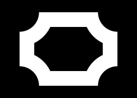
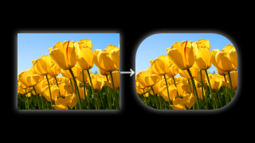
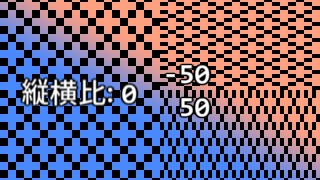
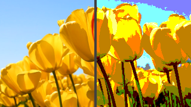
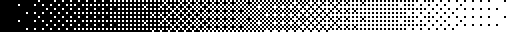

#	このスクリプト群について
丸角四角形や割合クリッピング/領域拡張，サイズ指定クリッピング/領域拡張，上下左右への位置揃えなど，私個人が AviUtl を使っていて「こういうのあった方がいいな/こういうのがむしろなぜないのか」などと思い，作っては書き溜めてきたものです．

それなりの量になってはいたものの，公開する機会がないまま放置気味だったため雑多な感じになっているのはご了承ください．また，各機能に共通する部分を別のファイルからの呼び出しで再利用している場面が多いためファイル数が多くなっています．導入時のファイル漏れにご注意ください．

機能の一覧は[こちら](#機能一覧).


#	必要・推奨環境

-	AviUtl

	**1.10 推奨**．1.00 でも動くとは思いますが未確認．

	-	公式サイト: http://spring-fragrance.mints.ne.jp/aviutl

-	拡張編集プラグイン

	**0.92 推奨**．0.93rc1 でも動くとは思いますが未確認．

-	LuaJIT (**推奨/一部機能で必須**)

	Lua スクリプト実行エンジンの高速化版．JIT コンパイルによる高速化のほか，高速化を支援する追加機能もあります．

	一部の機能は LuaJIT がある場合，LuaJIT の追加機能の FFI ライブラリを用いたより高速なコードで実行されるように書いています．また，ディザリング系のスクリプトは LuaJIT が必須です．

	-	LuaJIT 公式: https://luajit.org
	-	Auto Build によるバイナリ頒布 (非公式): https://github.com/Per-Terra/LuaJIT-Auto-Builds

-	patch.aul (**推奨**)

	AviUtl と拡張編集プラグイン 0.92 のバグを修正をする AviUtl プラグイン．

	必須ではありませんが一部スクリプトは patch.aul で修正されたフィルタ効果の見え方前提で組んでいるため ([内側縁取り](#内側縁取り)など), これがない場合不自然に見える可能性があります．[未導入時の不具合](#既知の問題)も確認しています．またキャッシュ画像の共有メモリへの退避など，見えないところでスクリプトの動作安定に役立っている部分も多いです．

	-	開発元ページ: https://github.com/ePi5131/patch.aul
	-	最新フォーク: https://github.com/nazonoSAUNA/patch.aul


#	導入方法

1.	[Releases](../../releases/) から `sigma_aviutl_scripts.zip` をダウンロードします．

1.	中の `.lua` ファイル全てと，欲しい機能の `.obj`, `.anm`, `.scn` ファイルを以下のフォルダのいずれかにコピーしてください．

	1.	拡張編集プラグイン (`exedit.auf`) のあるフォルダ．
	2.	(i)のフォルダ直下にある `script` フォルダ．
	3.	(ii)のフォルダ直下にある任意の名前のフォルダ．

		-	スクリプト製作者ごとにフォルダ分けするのがお奨めです．特にこのスクリプトは付属ファイルが多いためこちらの方法を推奨します．

	*ファイルは全て同一フォルダに配置してください．“バラけて”配置した場合正しく認識されないことがあります．*

	-	本当はもう少し自由度がありますが，正確には[こちら](#ファイル依存関係)をご参照ください．

1.	必要なら[付属ファイル](#付録)も配置してください．*(任意)*

#	機能一覧

`@` から始まる各ファイルごとに機能を分けています．随時更新予定．

1.	[`@単純図形σ.obj`](#単純図形σobj)

	1.	[矩形](#矩形)
	1.	[楕円](#楕円)
	1.	[菱形](#菱形)
	1.	[アクリル矩形](#アクリル矩形)
	1.	[磨りガラス矩形](#磨りガラス矩形)

1.	[`@単純変形σ.anm`](#単純変形σanm)

	1.	[領域拡大縮小](#領域拡大縮小)
	1.	[領域拡大縮小(割合)](#領域拡大縮小割合)
	1.	[領域サイズ指定](#領域サイズ指定)
	1.	[上下左右揃え](#上下左右揃え)
	1.	[回転中心](#回転中心)
	1.	[回転中心(画面基準)](#回転中心画面基準)
	1.	[XYZ軸回転](#xyz軸回転)
	1.	[軸指定回転](#軸指定回転)
	1.	[傾斜](#傾斜)
	1.	[中抜きクリッピング](#中抜きクリッピング)
	1.	[扇クリッピング](#扇クリッピング)
	1.	[透明度適用](#透明度適用)
	1.	[透明度強制](#透明度強制)

1.	[`@効果集σ.anm`](#効果集σanm)

	1.	[四隅丸め](#四隅丸め)
	1.	[アクリル素材](#アクリル素材)
	1.	[磨りガラス素材](#磨りガラス素材)
	1.	[アクリル化](#アクリル化)
	1.	[磨りガラス化](#磨りガラス化)
	1.	[背景塗りつぶし](#背景塗りつぶし)
	1.	[背景角丸矩形](#背景角丸矩形)
	1.	[背景楕円](#背景楕円)
	1.	[背景菱形](#背景菱形)
	1.	[内側シャドー](#内側シャドー)
	1.	[縁取りα](#縁取りα)
	1.	[内側縁取り](#内側縁取り)
	1.	[ニューモーフィズム](#ニューモーフィズム)

1.	[`@ディザσ.anm`](#ディザσanm)

	1.	[ディザマスク](#ディザマスク)
	1.	[ディザフェード](#ディザフェード)
	1.	[ディザ減色](#ディザ減色)
	1.	[ディザα階調](#ディザα階調)

1.	[`@ディザσ.scn`](#ディザσscn)

	1.	[ディザフェードアウトイン](#ディザフェードアウトイン)
	1.	[ディザワイプ(直線)](#ディザワイプ直線)
	1.	[ディザワイプ(図形)](#ディザワイプ図形)
	1.	[ディザワイプ(時計)](#ディザワイプ時計)

一部機能のパラメタ指定方法については別枠で紹介してあります．

-	[特殊なパラメタ指定方法](#特殊なパラメタ指定方法)

	1.	[水平揃え / 垂直揃え](#水平揃え--垂直揃え)
	1.	[余白](#余白)
	1.	[ファイル指定](#ファイル指定)
	1.	[ディザパターンの指定](#ディザパターンの指定)
	1.	[`TRACK`](#track)


#	`@単純図形σ.obj`

丸角四角形や菱形，アクリルガラス風のカスタムオブジェクトです．

##	矩形

図形オブジェクトの「四角形」を高機能にしたものです．


-	幅，高さをピクセル単位で個別に指定できます．
-	丸角半径を指定して丸角四角形を作れます．丸角半径も四頂点個別に指定できます．
	-	参考: [四隅丸め](#四隅丸め)
-	角の図形も円だけでなく任意の図形を指定できます．
-	右揃え・左揃え・上揃え・下揃えの指定も可能です．

###	パラメタ

1.	幅
1.	高さ

	矩形の幅・高さをピクセル単位で指定．図形オブジェクトとは違い，幅と高さを個別に指定できます．

	

1.	ライン幅

	図形オブジェクトの「ライン幅」に相当．幅や高さの半分以上の場合，塗りつぶし四角形を描画します．

	

1.	角半径

	丸角四角形を描画します．初期値は `0` で丸角なし．あまり大きい値にしても幅や高さの制限で頭打ちになります．

	

	*縦横比が 1:1 でない楕円のような丸角は指定できません．代わりにカスタム図形を使用することで実現できます．*

1.	角丸凹凸反転

	丸角を指定した場合の凹凸を反転します．

	

1.	色

	矩形の色を指定します．

	

1.	背景色．

	ライン幅を指定した場合の内側の色を指定します．
	背景透明度が `100` 以上のときは無視されます．

	

1.	背景透明度

	背景色の透明度を指定します．%単位で初期値は `100%` (背景色を描画しない設定) です．

	

1.	水平揃え
1.	垂直揃え

	幅や高さの起点を指定して上下左右に揃えます．初期値は`0` で中央揃え．`1` で左・上揃え．`-1` で右・下揃えになります．
	-	[パラメタ「水平揃え」「垂直揃え」について](#水平揃え--垂直揃え).
	-	参考: [上下左右揃え](#上下左右揃え)

1.	角丸図形

	角半径を指定した場合の角を切り取る図形を指定します．初期値は `"円"` で，カスタム図形を含め登録済みの図形が全て指定可能です．また，この項目を空欄にすると特別仕様として菱形 (◆) で切り取ります ($45\degree$ の直線切り欠き).

	

	*図形によって「角丸図形」に適した図形，適していない図形があります．ビルトインの図形だと実用的なのは円と四角形程度しかありません．*

1.	縁幅比率

	角半径とライン幅の両方を指定した場合，ラインの内側部分の図形サイズを決定する値で，主な用途はカスタム図形に対する調整です．初期値は自動選択の `-1` で，「角丸図形」に応じて変化します．通常は `1` 以上の実数で，小さい値だと丸角部分が細いラインに，大きいと太いラインになります．

	

	負の値を指定した場合「角丸図形」に応じて自動選択しますが，以下の表で値が決定します:

	図形|値|備考
	:---:|---|---
	菱形 (空欄)|`1.4142`| $\approx \sqrt 2$
	円|`1`
	四角形|`1`
	三角形|`2`| $= 1/\cos \frac{\pi}3$
	五角形|`1.2361`| $\approx 1/\cos \frac{\pi}5$
	六角形|`1.1547`| $\approx 1/\cos \frac{\pi}6$
	星型|`3.2361`| $\approx 1/\cos \frac{2}5\pi$
	(カスタム図形)|`1`|最適な値を各自見出してください．

	*「角丸図形」によって最適な値が変わってきますし，カスタム図形の場合，形状によってはどんな値でも不自然に見えることもあります．この辺りが一般の図形に対応したが故の限界だと思っています．*

1.	中心反転

	角半径とライン幅を指定したとき，ライン内側の角部分の切り取り方を2通りから指定します．初期値は `OFF`. このパラメタもカスタム図形に対する調整が目的です．
	
	
	
	指定した丸角図形を拡大するか縮小するか，そのときの中心位置は内側か外側か，が変わります．図形によってどちらが良いのかは違ってきますが
	(例えば[アステロイド](https://ja.wikipedia.org/wiki/%E3%82%A2%E3%82%B9%E3%83%86%E3%83%AD%E3%82%A4%E3%83%89_(%E6%9B%B2%E7%B7%9A) "Wikipedia: アステロイド_(曲線)")のような図形の場合，`ON` のほうが自然に見えます),
	AviUtl ビルトインの図形だと基本的にはチェックなしで OK です．

	*カスタム図形の場合，形状によってはどちらでも不自然に見えることもあります．*

1.	内側補外

	角半径とライン幅を指定したとき，ライン内側の角図形との境界をスムーズにつなぎます．初期値は `ON`.

	

	「縁幅比率」から角度を推定して，ギャップを埋めるような斜面を描画します．「縁幅比率」が `1` より大きくかつ，「角丸凹凸反転」と「中心反転」の両方が `OFF`, または両方が `ON` の場合のみ有効です．

1.	右上半径
1.	右下半径
1.	左下半径

	丸角半径を四頂点個別に指定することができます．初期値は `-1`. 負の数や数値以外を指定したり，空欄にすると左上の角半径と同じ値になります．左上の半径はトラックバーの「角半径」で指定します．

	

	*丸角図形は四頂点で統一です．個別指定はできません．*

1.	`TRACK`

	トラックバーやチェックボックスの値をスクリプトで書くことができます．
	-	[パラメタ `TRACK` について](#track).

####	余談

「丸角」と「角丸」どちらが標準なのかわかりませんが，検索してみた結果「角丸」が多い印象だったためスクリプト内では「角丸」表記を採用しています．しかし私自身は「丸角」派のため，この文書内では「丸角」表記が多いです．表記が違っていても特に差異や深い意味はありません．

[機能一覧へ戻る](#機能一覧)


##	楕円

図形オブジェクトの円を少し使いやすくしたものです．


-	幅，高さをピクセル単位で個別に指定できます．
-	真円でない場合のライン幅の不均一さを緩和しています．
-	ライン内部の塗りつぶし色や透明度も指定できます．
-	境界付近のぼかし幅を，図形オブジェクトの円に比べて狭くできます．
-	右揃え・左揃え・上揃え・下揃えの指定も可能です．

###	パラメタ

1.	幅
1.	高さ

	楕円の幅・高さをピクセル単位で指定．図形オブジェクトとは違い，幅と高さを個別に指定できます．

1.	ライン幅

	図形オブジェクトの「ライン幅」に相当．幅や高さの半分以上の場合塗りつぶした楕円を描画します．

	図形オブジェクトの円とは違い，縦横比が $1:1$ でない場合のライン幅の不均一さが緩和されています．

	

	単純に長径と短径をライン幅分だけ狭めた楕円で中抜きしているだけです．厳密に言えばまだ不均一ですが目立ちにくくはなっています．

1.	背景透明度

	ライン幅を指定した場合の背景色の透明度を%単位で指定します．初期値は `100%` (背景色を描画しない設定) です．

1.	真円

	幅と高さを統一して真円にします．「高さ」の値を無視して「幅」で指定した値を「高さ」として利用します．初期値は `OFF`.

	-	`TRACK` に `{ [2] = obj.track0 }` と書くのと同じ効力です．

1.	色

	楕円の色を指定します．

1.	背景色．

	ライン幅を指定した場合の内側の色を指定します．
	背景透明度が `100` 以上のときは無視されます．

1.	水平揃え
1.	垂直揃え

	幅や高さの起点を指定して上下左右に揃えます．初期値は`0` で中央揃え．`1` で左・上揃え．`-1` で右・下揃えになります．
	-	[パラメタ「水平揃え」「垂直揃え」について](#水平揃え--垂直揃え).
	-	参考: [上下左右揃え](#上下左右揃え)

1.	精度

	境界付近のぼかし幅を抑える値で，`1` 以上 `8` 以下の整数値．初期値は `4`．

	図形オブジェクトの「円」はアンチエイリアスの目的で透明度境界に約2ピクセル程度のぼかし幅を持たせています．この2ピクセル幅は意外と大きいため，この楕円カスタムオブジェクトでは図形オブジェクトの「円」を「精度」倍だけ大きめに読み込んでから縮小することで，このぼかし幅を縮小しています．

	

	`4` より大きい数値にしても, `4` の場合とほとんど変化がない上に重くなる一因にもなり得るので `4` 程度，またはそれ以下の値を推奨します．

	-	余談ですが，標準スクリプトの「多角形」でも頂点描画にライン幅の4倍の円を読み込み，それを縮小描画することでぼかし幅を抑えてる箇所があります．これはその手法の流用です．

1.	`TRACK`

	トラックバーやチェックボックスの値をスクリプトで書くことができます．
	-	[パラメタ `TRACK` について](#track).

[機能一覧へ戻る](#機能一覧)


##	菱形

菱形図形を描画します．


-	幅，高さをピクセル単位で個別に指定できます．
-	ライン内部の塗りつぶし色や透明度も指定できます．
-	右揃え・左揃え・上揃え・下揃えの指定も可能です．
-	丸角四角形で角図形の菱形を作った際の副産物です．

###	パラメタ

1.	幅
1.	高さ

	菱形の幅・高さをピクセル単位で指定．

1.	ライン幅

	図形オブジェクトの「ライン幅」に相当．幅や高さに比べて十分大きい場合塗りつぶした菱形を描画します．

1.	背景透明度

	ライン幅を指定した場合の背景色の透明度を%単位で指定します．初期値は `100%` (背景色を描画しない設定) です．

1.	正方形

	幅と高さを統一して正方形にします．「高さ」の値を無視して「幅」で指定した値を「高さ」として利用します．初期値は `OFF`.

	-	`TRACK` に `{ [2] = obj.track0 }` と書くのと同じ効力です．

1.	色

	菱形の色を指定します．

1.	背景色．

	ライン幅を指定した場合の内側の色を指定します．
	背景透明度が `100` 以上のときは無視されます．

1.	水平揃え
1.	垂直揃え

	幅や高さの起点を指定して上下左右に揃えます．初期値は`0` で中央揃え．`1` で左・上揃え．`-1` で右・下揃えになります．
	-	[パラメタ「水平揃え」「垂直揃え」について](#水平揃え--垂直揃え).
	-	参考: [上下左右揃え](#上下左右揃え)

1.	`TRACK`

	トラックバーやチェックボックスの値をスクリプトで書くことができます．
	-	[パラメタ `TRACK` について](#track).

[機能一覧へ戻る](#機能一覧)


##	アクリル矩形
##	磨りガラス矩形

背景をぼかして映した，磨りガラス板を置いたような矩形を描画します．字幕の背景に置くなどの用途を想定しています．


-	アクリル矩形と磨りガラス矩形の違いは，ぼかしに使うフィルタ効果のみです．
	|種類|フィルタ効果|主な違い
	|:---:|:---:|---
	アクリル矩形|ぼかし|縦横比の指定可能・動作が軽い
	磨りガラス矩形|レンズブラー|縦横比の指定不可・動作は重め

-	[矩形](#矩形)とは違い，ライン幅や丸角の機能はありません．[四隅丸め](#四隅丸め)を使って丸角にしたり，[アクリル化](#アクリル化)/[磨りガラス化](#磨りガラス化)を使うなどでも実現できます．
-	Windows 10 の UI 要素の1つ，[アクリルブラシ](https://learn.microsoft.com/ja-jp/windows/apps/design/style/acrylic)を模したものです．ただしノイズレイヤーに相当するものはありません．

###	パラメタ

1.	幅
1.	高さ

	幅・高さをピクセル単位で指定．

1.	ぼかし量

	背景をぼかすサイズを指定します．

1.	着色強さ

	フィルタ効果の単色化で色を付ける際の「強さ」を%単位で指定します．

1.	着色で輝度を保持

	フィルタ効果の単色化で色を付ける際の「輝度を保持する」オプションを指定します．`ON` だと背景が透過している印象が強くなります．

1.	色

	矩形の色を指定します．

1.	水平揃え
1.	垂直揃え

	幅や高さの起点を指定して上下左右に揃えます．初期値は`0` で中央揃え．`1` で左・上揃え．`-1` で右・下揃えになります．
	-	[パラメタ「水平揃え」「垂直揃え」について](#水平揃え--垂直揃え).
	-	参考: [上下左右揃え](#上下左右揃え)

1.	ぼかし縦横比

	「アクリル矩形」にのみ存在します．フィルタ効果の「ぼかし」に渡す縦横比を `-100` から `100` までの値で指定．
	負のとき縦長，正のとき横長のぼかしになります．

1.	ぼかし光度

	フィルタ効果の「ぼかし」 or 「レンズブラー」に使う「光の強さ」を指定します．

1.	輝度倍率

	透過する背景の輝度を定数倍して補正します．単位は%で範囲は `0%` から `200%`, 初期値は `30%`.
	高いほど背景の陰影が強くなってきます．

	

1.	輝度中心

	透過する背景の輝度に定数加算することで基準値に補正します．単位は%で範囲は `-100%` から `200%`, 初期値は `50%`.
	背景の輝度50%ピクセルを補正した結果の輝度が指定した値になります．高くすると全体的に白っぽく，低いと黒っぽくなります．

	

1.	彩度

	背景の彩度を定数倍して補正します．単位は%で範囲は `0%` から `200%`, 初期値は `100%`.
	高いほど背景の色味が強く出てきます．

	

1.	色相

	背景の色相を回転させて補正します．度数法で指定, $360\degree$ で1周します．

	-	フィルタ効果の色調補正を使うため patch.aul での色相計算修正 (`obj_colorcorrection` 設定) の影響を受けます．

1.	`TRACK`

	トラックバーやチェックボックスの値をスクリプトで書くことができます．
	-	[パラメタ `TRACK` について](#track).


###	注意

このカスタムオブジェクトを回転させたり，フィルタ効果の「座標」などで移動させた場合，背景も一緒に動いておかしな見え方になってしまいます．これは仕様上仕方のないものと思って，回転やフィルタ効果の「座標」を使わない，あるいは[矩形](#矩形)に[XYZ軸回転](#xyz軸回転)等を「描画」チェックを `ON` にして適用した後[アクリル化](#アクリル化)や[磨りガラス化](#磨りガラス化)を使うなど工夫をしてください．

[機能一覧へ戻る](#機能一覧)


#	`@単純変形σ.anm`

クリッピングや領域拡張でパラメタ指定の別方法を用意したり，回転中心の移動や上下左右揃えができるアニメーション効果集です．回転・傾斜等の変形，透明度操作などもあります．

##	領域拡大縮小

クリッピングと領域拡張を合わせたものです．領域拡張になかった「中心の位置を変更」もできます．

###	パラメタ

1.	上/下/左/右

	クリッピングや領域拡張の上/下/左/右と同じです．正の値で領域拡張，負の値でクリッピングの効果となります．

1.	中心の位置を変更

	クリッピングにある「中心の位置を変更」と同じ意味です．（内部的にはこのチェックが `ON` のとき回転中心が固定，`OFF` のとき回転中心が移動する仕掛けです．）

	元々の領域拡張の場合，「中心の位置を変更」が常に `OFF` と同等の挙動ですが，このアニメーション効果だと切り替えられます．

1.	塗りつぶし

	領域拡張の「塗りつぶし」と同じ効果です．

1.	`TRACK`

	トラックバーやチェックボックスの値をスクリプトで書くことができます．
	-	[パラメタ `TRACK` について](#track).

[機能一覧へ戻る](#機能一覧)


##	領域拡大縮小(割合)

[領域拡大縮小](#領域拡大縮小)のパラメタをピクセル数でなくオブジェクトサイズに応じた割合で設定できます．それ以外の点は領域拡大縮小と同じです．パラメタの説明はそちらをご参照ください．

[機能一覧へ戻る](#機能一覧)


##	領域サイズ指定

現在のオブジェクトから指定したサイズの画像を切り出します．

領域拡張やクリッピングを使う際，目的の画像サイズが決まっている場面も多いかと思います．その場合，これでサイズを決めてしまってから位置を動かして調節すると楽です．

また，位置調節用にアンカーを置いているので，これをマウスでドラッグすることでも位置を調節できます．

###	パラメタ

1.	X/Y

	切り出し範囲の基準座標です．アンカーと連動しているのでマウス操作で動かせます．初期状態だと切り出し範囲の中心が基準点ですが，「水平揃え」，「垂直揃え」のパラメタで左上座標や右下座標などに基準点を変更できます．

1.	幅
1.	高さ

	切り出し範囲の幅と高さです．この2つを先に決めてしまってから `X` と `Y` を動かすと楽だと思います．

1.	中心の位置を変更

	クリッピングにある中心の位置を変更と同じ意味の効果です．これを `ON` にしているとアンカーのマウス操作が逆転するので注意してください．

1.	塗りつぶし

	領域拡張の「塗りつぶし」と同じ効果です．切り出し範囲の一部がオブジェクトの範囲外に出た場合に有効です．

1.	水平揃え
1.	垂直揃え

	X, Y で指定する座標の基準点を変更します．初期値は `0` で中央揃え，`1` で左/上揃え，`-1` で右/下揃えになります．

	揃え方|指定|効果
	:---:|:---:|---
	中央揃え|`0`|X/Y は切り出し範囲の中央
	左揃え|水平揃えを `1`|X は切り出し範囲の左端
	右揃え|水平揃えを `-1`|X は切り出し範囲の右端
	上揃え|垂直揃えを `1`|Y は切り出し範囲の上端
	下揃え|垂直揃えを `-1`|Y は切り出し範囲の下端

	-	[パラメタ「水平揃え」「垂直揃え」について](#水平揃え--垂直揃え).
	-	[上下左右揃え](#上下左右揃え)


1.	幅指定無効
1.	高さ指定無効

	それぞれ水平，垂直方向にはクリッピングや領域拡張をしないようにします．高さだけ/幅だけを指定サイズに切り出したい場合にチェックを `ON` にしてください．

1.	`TRACK`

	トラックバーやチェックボックスの値をスクリプトで書くことができます．
	-	[パラメタ `TRACK` について](#track).

[機能一覧へ戻る](#機能一覧)


##	上下左右揃え

オブジェクトの基準座標を変えて上下左右揃えが簡単にできるようにします．

このアニメーション効果をつけると回転中心が $(0,0)$ になって中央揃えになります．そこから「左右%」や「上下%」のトラックバーを操作して回転中心を移動することで基準座標を変更できます．`100%` だと左・上揃え，`-100%` だと右・下揃え，`0%` だと中央揃えです．

###	パラメタ

1.	左右%

	左右方向の基準座標を操作します．`0%` だと中央揃え，`100%` で左揃え，`-100%` で右揃えです．このアニメーション効果をつける前の基準座標に戻したい場合はダイアログ内の「X相対指定」にチェックを入れたうえでこのトラックバーを `0%` に指定してください．

1.	上下%

	上下方向の基準座標を操作します．`0%` だと中央揃え，`100%` で上揃え，`-100%` で下揃えです．このアニメーション効果をつける前の基準座標に戻したい場合はダイアログ内の「Y相対指定」にチェックを入れたうえでこのトラックバーを `0%` に指定してください．

1.	Xずれ
1.	Yずれ

	基準座標をピクセル単位でずらしたい場合，このトラックバーで動かせます．例えば「基準座標から5ピクセルの余白を持たせる」などの使い方ができます．

1.	回転中心を移動

	`ON` のとき，オブジェクトの回転中心 (`obj.cx` と `obj.cy`) を移動することで基準座標を操作します．`OFF` のときは代わりに相対座標 (`obj.ox` と `obj.oy`) を操作します．初期値は `ON`.

1.	割合倍率

	「左右%」と「上下%」での基準座標のずらし量を定数倍します．初期値は `1.0`.
	
	元々右揃えだったオブジェクト（例えば右揃えのテキストオブジェクトなど）を「回転中心を移動」が `OFF` の状態で左揃えにしたい場合などは，基準座標のずらし量が2倍必要です．その場合ここに `2.0` を入力すれば「左右%」が `100%` で左揃えにできます．ただし「上下%」も同時に影響を受けるためこちらは通常指定の半分の値にする必要があります．

1.	X相対指定
1.	Y相対指定

	中心座標（あるいは「回転中心を移動」が `OFF` の場合，相対座標）を $(0,0)$ で初期化しないようにします．左右だけ/上下だけオブジェクトに元々あった揃え基準を採用したい場合にチェックを入れると便利です．

	初期値は `OFF`.

1.	`TRACK`

	トラックバーやチェックボックスの値をスクリプトで書くことができます．
	-	[パラメタ `TRACK` について](#track).

[機能一覧へ戻る](#機能一覧)


##	回転中心

オブジェクトの回転中心を変更します．フィルタ効果の「座標」が相対座標 (`obj.ox`, `obj.oy`, `obj.oz`) を操作するのに対して，こちらは回転中心 (`obj.cx`, `obj.cy`, `obj.cz`) を操作する目的で作りました．

一部条件でアンカーを設定しているため，マウス操作で回転中心を移動できます．

1.	X/Y/Z

	回転中心，またはその移動量を設定します．条件によってはアンカーが表示されるためマウス操作で座標指定できます．
	
1.	回転前の座標で指定

	X/Y/Zの指定を，`OFF` のときは回転後の，`ON` のときは回転前の座標基準で移動します．初期値は `OFF`.

	-	*これが `ON` でかつ，このアニメーション効果より前にオブジェクトに回転が設定されている場合*，アンカーが非表示になります．

1.	相対座標連動

	回転中心 (`obj.cx`, `obj.cy`, `obj.cz`) の移動に加えて相対座標 (`obj.ox`, `obj.oy`, `obj.oz`) も連動して動かします．初期値は `ON`.

	回転中心だけだと，オブジェクト自身も見た目で移動してしまいますが，このチェックを入れると逆方向に相対座標も動かします．

	-	*これが `OFF` の場合*アンカーが非表示になります．

1.	移動量で指定

	X/Y/Zの指定を，回転中心の値を上書きではなく，現在の値からの相対値として解釈します．初期値は `OFF`.

	-	*これが `ON` の場合*アンカーが非表示になります．

1.	`TRACK`

	トラックバーやチェックボックスの値をスクリプトで書くことができます．
	-	[パラメタ `TRACK` について](#track).

###	注意

-	上で述べた条件の他にも，*カメラ制御が有効でなくかつオブジェクトの相対座標の Z 座標 (`obj.oz`) が `0` でない場合*もアンカーが非表示になります．これはアンカーの移動量と座標数値の移動量に $Z$ 座標が関わっていて，アンカー位置と回転中心とを一致させるのに補正が必要な上，補正したとしてもトラックバーの数値の意味が変わってしまうのが理由です．

-	後続フィルタに移動や回転系のフィルタ効果がある場合，アンカー位置と回転中心とが一致しない場合もあります．この場合，後続フィルタを一時的にOFFにした上で調整するのがやりやすいと思います．調整が完了したら左上のマウスアイコンをクリックしてアンカーを非表示にすると見やすくなります．

-	「拡張描画」から中心座標や回転角度を指定した場合や，「標準描画」での回転角度指定もアンカー位置との相性が悪いです．色々模索はしましたが，この「回転中心」アニメーション効果でアンカーを使う場合は，「標準描画」や「拡張描画」での中心座標，回転角度指定はしない方が無難です．代わりにビルトインの「回転」フィルタ効果や，後述の[XYZ軸回転](#xyz軸回転)，[軸指定回転](#軸指定回転)をお使いください．

	-	patch.aul の機能 (`obj.getvalue("cx")` 等) を使えばアンカー位置と実際の回転中心を一致させること自体は実現できましたが，トラックバーの数値の意味が変わってしまうことになったため，やはり採用に至りませんでした．

[機能一覧へ戻る](#機能一覧)


##	回転中心(画面基準)

上述の[回転中心](#回転中心)の座標指定を，オブジェクトとの相対位置ではなく画面上の位置を基準として指定します．

パラメタや注意点などについては「回転中心」の項目をご参照ください．ただし画面基準であるため「相対座標連動」と「移動量で指定」の項目は無意味なのでありません．アンカーも使えません．

[機能一覧へ戻る](#機能一覧)


##	XYZ軸回転

ビルトインのフィルタ効果「回転」だと, $Z\rightarrow Y \rightarrow X$ 軸の順に回転するのが固定で，「回転」効果を複数設定しても回転角度が累積するだけで回転軸の適用順序は変えられません．それを解決するために作りました．

このアニメーション効果以前に適用された回転に合成する形でさらに回転させます．また，回転後に「描画」することで回転状態のない平面画像に仕立て直して，例えば凸エッジやシャドーを意図した位置，角度で使えます．

###	パラメタ

1.	X軸回転
1.	Y軸回転
1.	Z軸回転

	回転角度を度数法で指定します．回転順序は $Z\rightarrow Y \rightarrow X$ と，通常の「回転」フィルタ効果と変わりませんが，「XYZ軸回転」を複数設定して，「1つ目は $X$ 軸回転，2つ目は $Z$ 軸回転」と設定することで $X \rightarrow Z$ の順序で回転を適用できます．

1.	カメラZ

	後述の「描画」が `ON` のときのみ有効です．平面画像に落とし込む際のカメラの $Z$ 座標を指定します．初期値は `-1024`.

1.	描画

	回転させた画像を平面に描画して，回転効果のない平面画像オブジェクトとして仕立て直します．初期値は `OFF`.
	
	凸エッジやシャドーなど後続のフィルタ効果が一緒に回転しなくなるため，意図通りの位置，角度に設定しやすくなります．

	

	AviUtl の「回転」は通常，各種フィルタ効果を適用した後フレームバッファに書き込む最終段階でのみ適用されます．それをもっと早い手前の段階で適用させることができます．(ついでに，拡大率 `obj.zoom` や縦横比 `obj.aspect` も早期適用しています．)

	余談ですが，立体回転させて「描画」した画像をさらに立体回転させると「トリックアート」的な見え方になってちょっと面白いです．

1.	裏面を描画しない

	「描画」が `ON` のときのみ有効，拡張描画にある「裏面を描画しない」と同等の効果です．初期値は `OFF`.
	拡張描画の「裏面を描画しない」の効果はスクリプト中には乗せられず取得もできないため，別枠での指定となります．

1.	`TRACK`

	トラックバーやチェックボックスの値をスクリプトで書くことができます．
	-	[パラメタ `TRACK` について](#track).

[機能一覧へ戻る](#機能一覧)


##	軸指定回転

回転軸を $X, Y, Z$ 軸に限らない，任意に指定した軸で回転させられます．[XYZ軸回転](#xyz軸回転)と同様，このアニメーション効果以前に適用された回転があった場合，それに合成する形で回転させます．回転後の「描画」機能もあります．

###	パラメタ

1.	軸X成分
1.	軸Y成分
1.	軸Z成分

	回転軸を表すベクトルのそれぞれ $X, Y, Z$ 成分を設定します．初期値は $(100,0,0)$ で $X$ 軸と平行，同じ向きです．アンカーを設定しているためマウスで操作できます．

	-	[回転中心](#回転中心)などで回転中心が変わっている場合など，回転中心からアンカー線が伸びていなくて設定しにくい場合があるかもしれませんが，仕様上致し方がなかったため予めご了承ください．

1.	回転角度

	指定した軸に対する回転角度を度数法で設定します．指定した向きに対して右ネジを締める方向に正です．初期値は `0`.

1.	描画
1.	カメラZ
1.	裏面を描画しない

	[XYZ軸回転](#xyz軸回転)の「描画」「カメラZ」「裏面を描画しない」と同様です．

1.	`TRACK`

	トラックバーやチェックボックスの値をスクリプトで書くことができます．
	-	[パラメタ `TRACK` について](#track).

[機能一覧へ戻る](#機能一覧)


##	傾斜

画像を傾けて歪めます．~~むしろなぜ標準でなかったのか...?~~


###	パラメタ

1.	角度

	傾斜の角度を度数法で指定します．値域は `-80` から `80` です．
	
	-	「傾き%」と組み合わせた場合, tangent での和をとって適用します．

1.	傾き%

	傾斜の角度をその tangent (正接)で，%単位で指定します．値域は `-500%` から `500%` です．

	-	「角度」と組み合わせた場合, tangent での和をとって適用します．

1.	中心

	傾斜の基準となる中心線をずらします．

	

1.	基準軸

	傾斜の基準となる軸を，水平方向からのなす角度で度数法で指定します．初期値は `0` (水平方向), 反時計回りに正.

	

1.	回転中心基準

	`ON` のとき傾斜の基準となる中心線を，回転中心を基準にして決定します．`OFF` のときは画像の中心を基準にします．初期値は `ON`.

1.	`TRACK`

	トラックバーやチェックボックスの値をスクリプトで書くことができます．
	-	[パラメタ `TRACK` について](#track).

[機能一覧へ戻る](#機能一覧)


##	中抜きクリッピング

通常のクリッピングは画像の端を切り落としますが，これは画像の中間を切り落とします．長いリストの画像を中略するなどの目的で使えます．


###	パラメタ

1.	X/Y

	切り落とす範囲を表す座標を指定します．初期値は $(0,0)$ で画像の中央．アンカーが設定されているのでマウス操作で調整できます．

	初期状態だと切り落とす範囲の中心座標ですが「水平揃え」「垂直揃え」のパラメタで上下左右端にも設定できます．

1.	幅
1.	高さ

	切り落とす範囲の幅と高さをピクセル単位で指定します．初期値は `0`.

1.	中心の位置を変更

	画像の中心座標を元画像と合わせます．初期値は `OFF`.
	フィルタ効果の「クリッピング」の「中心の位置を変更」と同等の効果です．

	-	これを指定しているとアンカー位置がずれて表示されますが，仕様上致し方がなかったため予めご了承ください．

1.	余白幅
1.	余白高さ

	切り落とした間のギャップの長さをピクセル単位で設定します．初期値は `0`.
	
	正の値を指定すると間に空白を挿入します．負の値だと間をグラデーションで埋めます．

	

1.	水平揃え
1.	垂直揃え

	切り落とす範囲の位置指定基準を設定します．`0` で中央揃え，`1` で左/上揃え，`-1` で右/下揃えになります．

	揃え方|指定|効果
	:---:|:---:|---
	中央揃え|`0`|X/Y は切り落とす範囲の中央
	左揃え|水平揃えを `1`|X は切り落とす範囲の左端
	右揃え|水平揃えを `-1`|X は切り落とす範囲の右端
	上揃え|垂直揃えを `1`|Y は切り落とす範囲の上端
	下揃え|垂直揃えを `-1`|Y は切り落とす範囲の下端

	-	[パラメタ「水平揃え」「垂直揃え」について](#水平揃え--垂直揃え).
	-	参考: [上下左右揃え](#上下左右揃え)

1.	`TRACK`

	トラックバーやチェックボックスの値をスクリプトで書くことができます．
	-	[パラメタ `TRACK` について](#track).

[機能一覧へ戻る](#機能一覧)


##	扇クリッピング

図形を扇形に切り取ります．ぼかし幅の角度指定もできます．


###	パラメタ

1.	中心X
1.	中心Y

	扇形の中心点を指定します．アンカーを設定しているのでマウス操作で調整できます．

1.	開始角
1.	終了角

	切り取り範囲の開始/終了角を度数法で設定します．真上が `0` で時計回りに正です．

1.	指定範囲を残す

	「開始角」「終了角」で指定した範囲を切り取るのではなく残します．逆にこの範囲外が切り取られます．

1.	ぼかし角度

	切り取り部分にぼかしを設定できます．度数法で角度を指定します．初期値は `0`.

1.	半透明に配慮

	対象オブジェクトに半透明ピクセルがあり，ぼかし角度を設定している場合に `ON` にしてください．これが `OFF` だとアルファ値の計算が正確ではありませんが描画手順が一部省けるため，完全不透明画像に対しては `OFF` を設定しておくとパフォーマンスがよくなります．初期値は `OFF`.
	
	`OFF` で半透明ピクセルがあっても余程のことがない限り気にならないはずです．

1.	`TRACK`

	トラックバーやチェックボックスの値をスクリプトで書くことができます．
	-	[パラメタ `TRACK` について](#track).

###	余談

内部名は `pizza_cut` です．~~お腹空いた...~~

[機能一覧へ戻る](#機能一覧)


##	透明度適用

画像に透明度を上乗せします．また，「マイナスの透明度」を設定することで輪部のアンチエイリアスによるぼかし幅を抑えたりもできます．

フィルタ効果の「透明度」だと最終描画時にしか適用されませんが，こちらは即座にアルファ値が変わるので後続のフィルタ効果にも影響を与えられます．また，フィルタ効果の「透明度」で設定された値を現在画像のアルファ値に転換することもできます．

-	標準描画や拡張描画の「透明度」は転換できません．これらのアルファ値はまた別枠で管理されていて，スクリプト側からは `obj.getvalue("alpha")` で取得できますが再設定できません．

###	パラメタ

1.	透明度

	上乗せする透明度で単位は%，値域は `-100%` から `100%`.
	`100%` を指定すると完全透明な画像になります．負の値の場合は逆にアルファ値が増加し，`-100%` でアルファ値が2倍になります．

1.	このフィルタ以前の透明度も適用

	フィルタ効果の「透明度」などで設定された透明度も適用します．(`obj.alpha` の値も各ピクセルのアルファ値に乗算したのち `obj.alpha` は `1.0` に再設定されます．)

1.	`TRACK`

	トラックバーやチェックボックスの値をスクリプトで書くことができます．
	-	[パラメタ `TRACK` について](#track).

[機能一覧へ戻る](#機能一覧)


##	透明度強制

画像の全ピクセルの透明度を指定した値に設定します．本来完全透明で，見えずに隠されていたピクセルの色が見えるため注意．

###	パラメタ

1.	透明度

	設定する透明度で単位は%. 初期値は `0%` (完全不透明).

1.	`TRACK`

	トラックバーやチェックボックスの値をスクリプトで書くことができます．
	-	[パラメタ `TRACK` について](#track).


#	`@効果集σ.anm`

丸角矩形やアクリル矩形，磨りガラス矩形に使われている処理の一部分だけを適用できます．他にも背景の透明部分の処理，おなじみ内側シャドーやアルファ値付きの縁取りなど，雑多なアニメーション効果をまとめています．

[機能一覧へ戻る](#機能一覧)

##	四隅丸め

図形の四隅を丸めます．主に写真画像ファイルなど，完全不透明な長方形での使用を想定しています．

[矩形オブジェクト](#矩形)で利用している処理の一部分です．パラメタや仕様の多くが共通しているので矩形オブジェクトの項目もご参照ください．



###	パラメタ

1.	左上半径
1.	右上半径
1.	右下半径
1.	左下半径

	四隅の半径をピクセル単位でそれぞれ指定します．
	
	初期状態では「半径均一」のチェックが入っているため，「左上半径」で4つ全ての丸角半径を指定，他の3つは無視されます．

1.	半径均一

	4つの丸角半径を統一するかどうかを指定します．初期値は `ON` で，このとき「左上半径」のトラックバーの値だけが意味を持ちます．4つの半径を個別に指定したい場合は `OFF` にしてください．

1.	角図形

	角を切り取る図形を指定します．初期値は `"円"` で，カスタム図形を含め登録済みの図形が全て指定可能です．また，この項目を空欄にすると特別仕様として菱形 (◆) で切り取ります ($45\degree$ の直線切り欠き).

1.	凹凸反転

	丸角の凹凸を反転します．

1.	半透明に配慮

	丸角図形の境界に元画像の半透明ピクセルがある場合，そのアルファ値の計算を正確にします．初期値は `OFF`. 計算が不正確であっても実際のところ大きな影響は出ませんし，スクリプト内部で画像操作の手数が増えるため，ほとんどの場合は `OFF` のままで十分です．

1.	`TRACK`

	トラックバーやチェックボックスの値をスクリプトで書くことができます．
	-	[パラメタ `TRACK` について](#track).

[機能一覧へ戻る](#機能一覧)


##	アクリル素材
##	磨りガラス素材

[アクリル矩形](#アクリル矩形)や[磨りガラス矩形](#磨りガラス矩形)で利用している処理の一部分で，ぼかし・色調補正・着色の3つの処理を行います．パラメタや仕様の多くが共通しているので，そちらの項目もご参照ください．

###	パラメタ
1.	ぼかし量

	画像をぼかすサイズをピクセル単位で指定します．初期値は `16`.

1.	着色強さ

	フィルタ効果の単色化で色を付ける際の「強さ」を%単位で指定します．初期値は `20%`

1.	輝度倍率

	画像の輝度を定数倍して補正します．単位は%で範囲は `0%` から `200%`, 初期値は `30%`.

1.	輝度中心

	画像の輝度を定数加算することで基準値に補正します．単位は%で範囲は `-100%` から `200%`, 初期値は `50%`.
	画像の輝度50%ピクセルを補正した結果の輝度が指定した値になります．

1.	着色で輝度を保持

	フィルタ効果の単色化で色を付ける際の「輝度を保持する」オプションを指定します．初期値は `ON`.

1.	色

	着色時の「単色化」フィルタ効果に渡す色を指定します．初期値は `0x808080` (50%の灰色).

1.	ぼかし縦横比

	「アクリル素材」にのみ存在します．フィルタ効果の「ぼかし」に渡す縦横比を `-100` から `100` までの値で指定．初期値は `0`.

	負のとき縦長，正のとき横長のぼかしになります．

1.	ぼかし光度

	フィルタ効果の「ぼかし」 or 「レンズブラー」に使う「光の強さ」を指定します．初期値は，「アクリル素材」の場合 `0`, 「磨りガラス素材」の場合 `32`.

1.	彩度

	画像の彩度を定数倍して補正します．単位は%で範囲は `0%` から `200%`, 初期値は `100%`.

1.	色相

	画像の色相を回転させて補正します．度数法で指定, $360\degree$ で1周，初期値は `0`.

	-	フィルタ効果の色調補正を使うため patch.aul での色相計算修正 (`obj_colorcorrection` 設定) の影響を受けます．

1.	`TRACK`

	トラックバーやチェックボックスの値をスクリプトで書くことができます．
	-	[パラメタ `TRACK` について](#track).

[機能一覧へ戻る](#機能一覧)


##	アクリル化
##	磨りガラス化

オブジェクトの背景画像を切り取って，上記の[アクリル素材](#アクリル素材) or [磨りガラス素材](#磨りガラス素材)を適用することで，背景が透けて見えるかのような効果を実現します．[アクリル矩形](#アクリル矩形)や[磨りガラス矩形](#磨りガラス矩形)も併せてご参照ください．


###	パラメタ

1.	ぼかし量

	背景をぼかすサイズをピクセル単位で指定します．初期値は `16`.

1.	着色強さ

	-	下記の「単色化」チェックが `ON` の場合，フィルタ効果の単色化で色を付ける際の「強さ」を%単位で指定します．

	-	下記の「単色化」チェックが `OFF` の場合，元画像のピクセル色を合成する強さを%単位で指定します．

	初期値は `20%`.

1.	Xずれ
1.	Yずれ

	透過している背景を左右・上下にずらします．ずらし量をピクセル単位で指定．初期値は $(0,0)$ で，ずらしなし.

	

1.	着色で輝度を保持

	-	下記の「単色化」チェックが `ON` の場合，フィルタ効果の単色化で色を付ける際の「輝度を保持する」オプションを指定します．

	-	下記の「単色化」チェックが `OFF` の場合，元画像のピクセル色を合成する際に「色差」合成モードを利用するかどうかを指定します．

		-	「色差」合成モード: ピクセルの持つ「輝度(`Y`)」「青色差(`Cb`)」「赤色差(`Cr`)」の3成分のうち，「青色差(`Cb`)」「赤色差(`Cr`)」のみを上書きするモード．

	`ON` だと背景が透過している印象が強くなります．初期値は `ON`.

1.	単色化

	画像オブジェクトの元々の色ではなく，指定した色で着色するようにします．初期値は `OFF`.
	元画像の色が重要なのではなく，形状のみが重要なときに使います．

	

1.	色

	上記の「単色化」チェックが `ON` のときのみ有効，着色する際の色を指定します．初期値は `0x808080` (50%の灰色).

1.	ぼかし縦横比

	「アクリル化」にのみ存在します．フィルタ効果の「ぼかし」に渡す縦横比を `-100` から `100` までの値で指定．初期値は `0`.
	負のとき縦長，正のとき横長のぼかしになります．


1.	ぼかし光度

	フィルタ効果の「ぼかし」 or 「レンズブラー」に使う「光の強さ」を指定します．初期値は，「アクリル化」の場合 `0`, 「磨りガラス化」の場合 `32`.

1.	輝度倍率

	透過する背景の輝度を定数倍して補正します．単位は%で範囲は `0%` から `200%`, 初期値は `30%`.

1.	輝度中心

	透過する背景の輝度に定数加算することで基準値に補正します．単位は%で範囲は `-100%` から `200%`, 初期値は `50%`.
	背景の輝度50%ピクセルを補正した結果の輝度が指定した値になります．

1.	彩度

	背景の彩度を定数倍して補正します．単位は%で範囲は `0%` から `200%`, 初期値は `100%`.

1.	色相

	背景の色相を回転させて補正します．度数法で指定, $360\degree$ で1周，初期値は `0`.

1.	`TRACK`

	トラックバーやチェックボックスの値をスクリプトで書くことができます．
	-	[パラメタ `TRACK` について](#track).

[機能一覧へ戻る](#機能一覧)


##	背景塗りつぶし

オブジェクトの透明ピクセルを指定色で塗りつぶします．透明度や余白の指定もできます．


###	パラメタ

1.	透明度

	背景色の透明度を%単位で指定します．初期値は `0%`.

1.	前透明度

	元画像の透明度を%単位で指定します．初期値は `100%`.
	
	「前景クリア」のチェックが入っているとき，中抜き部分の透明度を決定します．

1.	前景クリア

	元画像の形状で背景を中抜きします．「前透明度」と組み合わせて中抜き部分の透明度の調節もできます．

	

1.	背景色

	背景の塗りつぶしに使う色を指定します．

1.	余白

	塗りつぶし領域の元画像からの余白をピクセル単位で指定します．初期値は `0` (余白なし).

	負の値を指定すると逆に画像がクリッピングされます．

	-	[パラメタ「余白」について](#余白).

1.	`TRACK`

	トラックバーやチェックボックスの値をスクリプトで書くことができます．
	-	[パラメタ `TRACK` について](#track).

[機能一覧へ戻る](#機能一覧)


##	背景角丸矩形

画像サイズに合わせた丸角矩形を背景に配置します．パラメタや仕様の多くが[矩形](#矩形)と共通しているので，詳しくはそちらをご参照ください．


###	パラメタ

1.	ライン幅
1.	角半径
1.	角丸凹凸反転
1.	色
1.	背景色
1.	背景透明度
1.	角丸図形
1.	縁幅比率
1.	中心反転
1.	内側補外
1.	右上半径
1.	右下半径
1.	左下半径

	[矩形](#矩形)でのパラメタとほぼ同じ効果です．

1.	透明度

	背景に配置する矩形全体の透明度を%単位で指定します．初期値は `0%`.

1.	前透明度

	元画像の透明度を%単位で指定します．初期値 `100%`.

1.	余白

	背景の丸角矩形の，元画像からの余白をピクセル単位で指定します．初期値は `0` (余白なし).

	負の値を指定すると逆に背景の丸角矩形が内側に引っ込みます．[背景塗りつぶし](#背景塗りつぶし)とは違い元画像はクリッピングされません．

	-	[パラメタ「余白」について](#余白).

1.	`TRACK`

	トラックバーやチェックボックスの値をスクリプトで書くことができます．
	-	[パラメタ `TRACK` について](#track).

[機能一覧へ戻る](#機能一覧)


##	背景楕円

画像サイズに合わせた楕円を背景に配置します．パラメタや仕様の多くが[楕円](#楕円)と共通しているので，詳しくはそちらをご参照ください．


###	パラメタ

1.	ライン幅
1.	精度
1.	色
1.	背景色
1.	背景透明度

	[楕円](#楕円)でのパラメタとほぼ同じ効果です．

1.	透明度

	背景に配置する楕円全体の透明度を%単位で指定します．初期値は `0%`.

1.	前透明度

	元画像の透明度を%単位で指定します．初期値 `100%`.

1.	内接する

	楕円が元画像全体を含むようにサイズを調節します．初期値は `ON`.
	
	`OFF` のときは元画像の範囲に収まるように楕円のサイズを調節します．

	

1.	余白

	背景の楕円の，元画像からの余白をピクセル単位で指定します．初期値は `0` (余白なし).

	負の値を指定すると逆に背景の楕円が内側に引っ込みます．[背景塗りつぶし](#背景塗りつぶし)とは違い元画像はクリッピングされません．

	-	[パラメタ「余白」について](#余白).

1.	真円

	幅と高さをそろえて真円にします．

	-	「内接する」が `ON` のとき，元画像の4頂点全てを含む最小のサイズになります．
	-	「内接する」が `OFF` のとき，元画像の幅と高さ，どちらか大きいほうに幅と高さをそろえます．

1.	`TRACK`

	トラックバーやチェックボックスの値をスクリプトで書くことができます．
	-	[パラメタ `TRACK` について](#track).

[機能一覧へ戻る](#機能一覧)


##	背景菱形

画像サイズに合わせた菱形を背景に配置します．パラメタや仕様の多くが[菱形](#菱形)と共通しているので，詳しくはそちらをご参照ください．


###	パラメタ

1.	ライン幅
1.	色
1.	背景色
1.	背景透明度

	[菱形](#菱形)でのパラメタとほぼ同じ効果です．

1.	透明度

	背景に配置する菱形全体の透明度を%単位で指定します．初期値は `0%`.

1.	前透明度

	元画像の透明度を%単位で指定します．初期値は `100%`.

1.	内接する

	菱形が元画像全体を含むようにサイズを調節します．初期値は `ON`.
	
	`OFF` のときは元画像の範囲に収まるように菱形のサイズを調節します．

	

1.	余白

	背景の菱形の，元画像からの余白をピクセル単位で指定します．初期値は `0` (余白なし).

	負の値を指定すると逆に背景の菱形が内側に引っ込みます．[背景塗りつぶし](#背景塗りつぶし)とは違い元画像はクリッピングされません．

	-	[パラメタ「余白」について](#余白).

1.	正方形

	幅と高さをそろえて正方形にします．

	-	「内接する」が `ON` のとき，元画像の4頂点全てを含む最小のサイズになります．
	-	「内接する」が `OFF` のとき，元画像の幅と高さ，どちらか大きいほうに幅と高さをそろえます．

1.	`TRACK`

	トラックバーやチェックボックスの値をスクリプトで書くことができます．
	-	[パラメタ `TRACK` について](#track).

[機能一覧へ戻る](#機能一覧)


##	内側シャドー

画像の内側に「シャドー」のフィルタ効果と同等の効果を適用します．パターン画像も設定できます．ただしビルトインのシャドーよりも低速で，「影を別オブジェクトで描画」に相当するオプションもありません．

パラメタの初期値はビルトインのシャドーに倣っています．


###	パラメタ

1.	X/Y

	影の描画位置をピクセル単位で指定します．初期値は $(-40,24)$.

1.	濃さ

	影の濃さを%単位で指定します．初期値は `40%`.

1.	拡散

	影のぼかし量をピクセル単位で指定します．初期値は `10`.

1.	色

	影の色を指定します．初期値は `0x000000` (黒).

1.	パターン画像

	影にパターン画像を設定します．透明ピクセルのある画像を使用する場合は，下の「α値適用」にチェックを入れてください．

	-	[パラメタでのファイル指定について](#ファイル指定).

1.	α値適用

	パターン画像に透明ピクセルのある画像を使用するときにチェックを入れてください．チェックを入れない場合，透明ピクセルの背景を黒で塗りつぶしたのと同等の結果になります．逆に透明ピクセルがない場合，チェックを外すと描画手順が節約できて軽量化に貢献します．初期値は `ON`.

	-	パターン画像の位置ずらしのパラメタは用意していません．

1.	`TRACK`

	トラックバーやチェックボックスの値をスクリプトで書くことができます．
	-	[パラメタ `TRACK` について](#track).

[機能一覧へ戻る](#機能一覧)


##	縁取りα

半透明な「縁取り」フィルタ効果を適用します．元画像部分も半透明にしたり，パターン画像の適用もできます．

パラメタの初期値はビルトインの縁取りに倣っています．


###	パラメタ

1.	サイズ
1.	ぼかし
1.	縁色の設定

	通常の「縁取り」フィルタ効果と同様の設定です．サイズはピクセル単位，ぼかしは%単位での指定です．

1.	縁透明度

	縁取り部分の透明度を%単位で指定します．初期値は `0%`.

1.	内透明度

	元画像部分の透明度を%単位で指定します．初期値は `0%`.
	高くするにつれ，元画像部分が「中抜き」されていきます．

1.	パターン画像

	縁部分にパターン画像を設定します．透明ピクセルのある画像を使用する場合は，下の「α値適用」にチェックを入れてください．

	-	[パラメタでのファイル指定について](#ファイル指定).

1.	α値適用

	パターン画像に透明ピクセルのある画像を使用するときにチェックを入れてください．チェックを入れない場合，透明ピクセルの背景を黒で塗りつぶしたのと同等の結果になります．逆に透明ピクセルがない場合，チェックを外すと描画手順が節約できて軽量化に貢献します．初期値は `ON`.

1.	X位置
1.	Y位置

	パターン画像のパターン開始位置を指定します．ピクセル単位で，元画像の左上とパターン画像の左上が一致するときが原点 $(0,0)$ です．

1.	`TRACK`

	トラックバーやチェックボックスの値をスクリプトで書くことができます．
	-	[パラメタ `TRACK` について](#track).

[機能一覧へ戻る](#機能一覧)


##	内側縁取り

画像の内側に縁取りをします．[縁取りα](#縁取りα)と同様，縁取り部分や元画像を半透明にする機能もあります．また，パターン画像を設定したり，縁部分を透明ピクセルに置き換えて「除去」する機能もあります．


1.	サイズ
1.	ぼかし
1.	縁色の設定

	通常の「縁取り」フィルタ効果と同様の設定です．サイズはピクセル単位，ぼかしは%単位での指定です．

1.	縁透明度

	縁取り部分の透明度を%単位で指定します．初期値は `0%`.
	高くするにつれ，元画像の色成分割合が増えていきます．

1.	内透明度

	元画像部分の透明度を%単位で指定します．初期値は `0%`.

1.	縁を除去

	縁部分を透明ピクセルに置き換えて「除去」します．初期値は `OFF`.
	後述の「縁除去で縮小」のチェックも入れると画像サイズも縮小します．

	

1.	パターン画像
	縁部分にパターン画像を設定します．透明ピクセルのある画像を使用する場合は，下の「α値適用」にチェックを入れてください．

	-	[パラメタでのファイル指定について](#ファイル指定).

1.	α値適用

	パターン画像に透明ピクセルのある画像を使用するときにチェックを入れてください．チェックを入れない場合，透明ピクセルの背景を黒で塗りつぶしたのと同等の結果になります．逆に透明ピクセルがない場合，チェックを外すと描画手順が節約できて軽量化に貢献します．初期値は `ON`.

1.	X位置
1.	Y位置

	パターン画像のパターン開始位置を指定します．ピクセル単位で，元画像の左上とパターン画像の左上が一致するときが原点 $(0,0)$ です．

1.	縁除去で縮小

	前述の「縁を除去」が `ON` でかつ縁透明度が `0%` のときのみ有効．初期値は `OFF`.
	縁取りサイズやぼかしに応じて画像サイズを縮小します．

1.	`TRACK`

	トラックバーやチェックボックスの値をスクリプトで書くことができます．
	-	[パラメタ `TRACK` について](#track).

###	注意

-	このスクリプトの実行手順は大まかに...

	1.	領域拡張で「外枠」となる透明ピクセルを確保，
	1.	透明度反転，
	1.	通常の縁取りを適用，
	1.	元画像と合成

	...となっています．特に (i) と (iii) で画像サイズが大きくなりますが，増加ピクセル数は最大で「サイズ」の4倍にもなるため，設定によっては割と簡単に最大画像サイズを超えてしまいます．そうなると合成結果が不正確になってしまうため，元画像が大きく，さらに「サイズ」や「ぼかし」も大きい場面では特に注意してください．

-	このスクリプトを書くにあたって patch.aul の縁取り高速化コードを参考にしました．特に縁取りをする前に確保する「外枠」の最適なサイズや，「縁除去で縮小」機能の縮小幅の導出に必要でした．逆に言うと，patch.aul 未導入でこれらの機能を利用すると不自然な見え方となる可能性があります．

	-	それ以前に patch.aul 未導入時の縁取りは，特に「ぼかし」が大きくなると縦横で非対称な，歪な形になるバグがあるため，やはり導入を強く推奨します．

[機能一覧へ戻る](#機能一覧)


##	ニューモーフィズム

オブジェクトの周りに光と影を配置して立体的に見えるようにします．光や影の色も設定できます．


###	パラメタ

1.	幅

	光や影のベースとなる大きさをピクセル単位で指定します．負の値を指定すると内側に光や影が描かれて凹んでいる見え方になります．初期値は `30`.
	
	実際の光や影の大きさは「ぼかし比」の指定に応じて増えます．

1.	ぼかし比

	光や影がぼやけます．ぼかし幅を「幅」との比で，%単位で指定します．初期値は `50%`. 値域は `0%` から `500%` まで．

1.	強さ

	光や影の全体的な不透明度を%単位で指定します．初期値は `50%`.

	実際の不透明度は「バランス」の指定に応じて減少します．

1.	バランス

	光と影の不透明度のバランスを%単位で設定します．初期値は `0%` で，「強さ」で指定した不透明度がそのまま光や影の不透明度になります．

	背景色の明るさに応じて光や影がバランスよく見える値を探してください．

	-	正の値だと影部分の不透明度を下げて，相対的に光部分が強く見えるようになります．背景色が明るくて影が悪目立ちするときなどに指定してください．

	-	負の値だと光部分の不透明度を下げて，相対的に影部分が強く見えるようになります．背景色が暗くて光が悪目立ちするときなどに指定してください．

1.	光色

	光部分に描画する色を指定します．初期値は `0xffffff` (白)．

1.	影色

	影部分に描画する色を指定します．初期値は `0x000000` (黒)．

1.	光角度

	光の想定入射角度を度数法で指定します．真上が `0` で時計回りに正，初期値は `-45` (左上)です．

1.	`TRACK`

	トラックバーやチェックボックスの値をスクリプトで書くことができます．
	-	[パラメタ `TRACK` について](#track).

[機能一覧へ戻る](#機能一覧)


#	`@ディザσ.anm`

ディザリング（ドット誤差分散）処理をしたかのような効果を与えます．レトロゲームのような，ディザリングをした「かのような雰囲気」を重視しているため，単純なパターンディザリングのみですが，調整オプションはそれなりにそろえてあります．


***これらのアニメーション効果には LuaJIT が必須です．***

##	ディザマスク

ディザパターンに沿って順次透明ピクセルに置き換えていきます．特殊なフェードイン/アウトの用途を想定しています．


###	パラメタ

1.	強さ

	ディザパターンの透明ドットの全体に対する割合を%単位で指定します．初期値は `0%`.

	`50%`の場合，市松模様になります ([ランダムパターン](#ランダムパターン)を除く).

1.	サイズ

	ディザパターンの1ドットのサイズをピクセル単位で指定します．初期値は `1` で，値域は `1` から `200`.

	1ピクセル程度だと通常はエンコードノイズ等で潰れてしまいがちなので，ディザリングの雰囲気を出すためには大きめのサイズ指定を推奨します．

1.	Xずれ
1.	Yずれ

	ディザパターンの位置を指定します．他にディザリングを適用したオブジェクトがある場合の位置合わせなどに使えます．初期値は $(0,0)$ で，ずれなし．

	

1.	位置調整を画面基準に

	ディザパターンの基準位置を画面の中央にします．初期値は `OFF` で，オブジェクト画像の中央が基準位置になります．

	他にディザリングを適用したオブジェクトとの位置合わせがやりやすくなります．

	-	このアニメーション効果を適用した時点での描画位置設定を参考にパターン位置を算出します．後続フィルタに座標移動などのフィルタ効果がある場合，そのフィルタ効果の影響で位置がずれるので注意．

1.	パターン

	ディザリングのパターン模様を指定します．初期値は `4` (16 × 16 Bayer パターン).

	-	[ディザパターンの指定について](#ディザパターンの指定). (`0` の「パターンなし」は選べません．)

1.	(7)のシード

	「パターン」が `7` (ランダムパターン) の場合の乱数シード値を指定します．

1.	半透明を許可

	ディザパターンのドットに対して「完全透明」か「完全不透明」かの2択の他に，半透明な状態を許可します．「強さ」を連続的に変更した場合，急にドットが現れる/消えるのではなく半透明状態でフェードイン/アウトしてくるようになります．初期値は `OFF`.

	

1.	縦横比

	ディザパターンの1ドットの縦横比を指定します．初期値は `0`, 値域は `-100` から `100`.
	負の数で横長ドットに，正の数で縦長ドットになります．

	

1.	パターン反転

	ディザパターン中の，「どのドットから優先して透明/不透明にするか」の基準を反転します．他にディザリングを適用したオブジェクトとパターンを合わせたい場合などに使います．初期値は `OFF`.

1.	`TRACK`

	トラックバーやチェックボックスの値をスクリプトで書くことができます．
	-	[パラメタ `TRACK` について](#track).

[機能一覧へ戻る](#機能一覧)


##	ディザフェード

ビルトインのフィルタ効果「フェード」のディザマスク版で，フェードイン/アウトの時間を与えて登退場の演出ができます．

「フェード」が透明度で登退場するのに対して，「ディザフェード」はディザマスクの強さで登退場します．

ほとんどのパラメタが[ディザマスク](#ディザマスク)と共通しているので，そちらも併せてご参照ください．

###	パラメタ

1.	イン
1.	アウト

	登退場の時間を秒単位で指定します．初期値は `0.50`.

1.	サイズ
1.	縦横比
1.	位置調整を画面基準に
1.	パターン
1.	(7)のシード
1.	Xずれ
1.	Yずれ
1.	半透明を許可
1.	パターン反転

	[ディザマスク](#ディザマスク)のパラメタと同じ効果です．

1.	`TRACK`

	トラックバーやチェックボックスの値をスクリプトで書くことができます．
	-	[パラメタ `TRACK` について](#track).

[機能一覧へ戻る](#機能一覧)


##	ディザ減色

ディザパターンで画像の色数を減らしたような効果を与えます．


減色の方法は単なるビットマスクです．ただし各 R, G, B 成分の値が `255` の場合に限ってマスクしないようにしているため，値の範囲は `0` から `255` までの広い範囲を維持しています．

###	パラメタ

1.	R減色
1.	G減色
1.	B減色

	R (赤), G (緑), B (青) の各成分の減色量を，ビット数で指定．`0` から `8` ビットまで指定可能で，初期値は `0` (減色効果なし).

	ビット数を1増やすごとに色数は約半分になりますが，正確には以下の表の通りです．

	ビット数|色数|取り得る値
	:---:|---:|---
	`0`| $256$ | $0$ から $255$ までの全ての整数
	`1`| $129$ | $0, 2, 4, 6, \dots , 252, 254, 255$
	`2`| $65$ | $0, 4, 8, 12, \dots , 252, 255$
	`3`| $33$ | $0, 8, 16, 24, \dots , 248, 255$
	`4`| $17$ | $0, 16, 32, 48, \dots , 240, 255$
	`5`| $9$ | $0, 32, 64, 96, \dots , 224, 255$
	`6`| $5$ | $0, 64, 128, 192, 255$
	`7`| $3$ | $0, 128, 255$
	`8`| $2$ | $0, 255$

1.	サイズ

	ディザパターンの1ドットのサイズをピクセル単位で指定します．初期値は `1` で，値域は `1` から `200`.
	1ピクセル程度だと通常はエンコードノイズ等で潰れてしまいがちなので，ディザリングの雰囲気を出すためには大きめのサイズ指定を推奨します．

1.	サイズに応じて解像度を落とす

	「サイズ」に応じた大きさのモザイク状の画像にします．初期値は `ON`.
	`OFF` にすると，ディザパターンの1ドットの中にも画像のピクセル模様が見えます．

	

	「サイズ」が `2` 以上のときのみ有効．また，「サイズ」が大きい場合は `ON` のほうが高速です．

	減色量を指定せずに単なるモザイクとしても使えます．

	-	フィルタ効果の「モザイク」に比べると，「縦横比」「Xずれ」「Yずれ」などの機能が使えるなどの点が異なります．

1.	パターン

	ディザリングのパターン模様を指定します．初期値は `4` (16 × 16 Bayer パターン).

	-	[ディザパターンの指定について](#ディザパターンの指定).

	`0` (パターンなし) を指定した場合，誤差分散のしないビットマスク減色を行います．

		

1.	(7)のシード

	「パターン」が `7` (ランダムパターン) の場合の乱数シード値を指定します．

1.	縦横比
1.	Xずれ
1.	Yずれ
1.	ずれ画面基準

	[ディザマスク](#ディザマスク)の「縦横比」「Xずれ」「Yずれ」「ずれ画面基準」と同等の効果です．詳しくはそちらをご参照ください．

1.	縮小補間

	「サイズ」が `2` 以上でかつ，「サイズに応じて解像度を落とす」が `ON` のときのみ有効．モザイク状パターンを作る際の縮小「リサイズ」フィルタ効果での「補間する」オプションを指定します．初期値は `ON`.

	`OFF` にすると各ドットの色にバラつきが出やすくなり，動きに応じて激しく明滅するモザイクになります．通常想定される範囲の用途だと `ON` のままで OK です．

1.	拡大補間

	「サイズ」が `2` 以上でかつ，「サイズに応じて解像度を落とす」が `ON` のときのみ有効．モザイク状パターンを作る際の拡大「リサイズ」フィルタ効果での「補間する」オプションを指定します．初期値は `OFF`.

	`ON` にするとジャギー効果は減りますが，モザイクパターンがぼやけたように見えます．`OFF` にするとドットパターンが目立って表示されます．

1.	半透明に配慮

	対象画像に透明/半透明ピクセルが含まれる場合に `ON` にしてください．初期値は `OFF`.
	`OFF` にすることで透明/半透明ピクセルの取り扱いに必要な手順を省きます．

1.	`TRACK`

	トラックバーやチェックボックスの値をスクリプトで書くことができます．
	-	[パラメタ `TRACK` について](#track).

[機能一覧へ戻る](#機能一覧)


##	ディザα階調

画像のアルファ値 (透明度) を階段状にします．誤差分散としてディザパターンを与えることもできます．


###	パラメタ

1.	α精度

	アルファ値の「階段の段数」を決定します．初期値は `30` で値域は `0` から `30`.

	`0` だと最終的なアルファ値は 0% と 100% のみになります．高いほど「階段の段数」が増えて徐々に境界が見えにくくなり，`30` で元のアルファ値そのままの値が使われるようになります．

1.	サイズ

	ディザパターンの1ドットのサイズをピクセル単位で指定します．初期値は `1` で，値域は `1` から `200`.
	1ピクセル程度だと通常はエンコードノイズ等で潰れてしまいがちなので，ディザリングの雰囲気を出すためには大きめのサイズ指定を推奨します．

1.	色の解像度を保つ

	`OFF` にすると画像の色成分もドットパターンのサイズにモザイク化します．初期値は `OFF`.

	

	`ON` の場合，既に完全透明なピクセルが見えてしまわないような工夫などで工程数が増えるため遅くなります．

1.	縦横比
1.	Xずれ
1.	Yずれ
1.	ずれ画面基準
1.	パターン反転

	[ディザマスク](#ディザマスク)の「縦横比」「Xずれ」「Yずれ」「ずれ画面基準」「パターン反転」と同等の効果です．詳しくはそちらをご参照ください．

1.	パターン

	ディザリングのパターン模様を指定します．初期値は `4` (16 × 16 Bayer パターン).

	-	[ディザパターンの指定について](#ディザパターンの指定).

	`0` (パターンなし) を指定した場合，誤差分散せずアルファ値を各ピクセルごとに近い階調に丸めます．

1.	(7)のシード

	「パターン」が `7` (ランダムパターン) の場合の乱数シード値を指定します．

1.	α値低解像度

	アルファ値をディザパターンの各ドットごとに平均化してモザイク化します．初期値は `ON`.
	`OFF` にするとパターンのドットの中にもアルファ値が高いピクセルや低いピクセルが現れます

	-	[ディザ減色](#ディザ減色)の「サイズに応じて解像度を落とす」に相当するオプションです．

1.	`TRACK`

	トラックバーやチェックボックスの値をスクリプトで書くことができます．
	-	[パラメタ `TRACK` について](#track).

[機能一覧へ戻る](#機能一覧)


#	`@ディザσ.scn`

ディザリング（ドット誤差分散）っぽい雰囲気のシーンチェンジ集です．[`@ディザσ.anm`](#ディザσanm) (正確には，その実体である `sigma_dither.lua`) の応用として書きました．

***これらのシーンチェンジには LuaJIT が必須です．***

###	余談

私自身，動画編集の際のシーン切り替えは他のオブジェクトやフィルタ効果を組み合わせて作っているため，シーンチェンジ機能はあまり使ったことがありません．なのでここで紹介している機能が使いやすいのかどうか，一般的にどういう使い方がされているのかなどよくわかっていません．もし使いにくかった場合，「ここはこういう風になっていたなら使いやすいのに」といった提案/指摘をしていただけると助かります．

##	ディザフェードアウトイン

[ディザマスク](#ディザマスク)の応用です．ディザマスクでフェードアウトしてから次シーンの画像をディザマスクでフェードインします．「重複率」を `100%` にすれば直接次シーンへのフェードもできます．


パラメタのほとんどがディザマスクのものと同じ意味なので，ディザマスクの項目も併せてご参照ください．

###	パラメタ

1.	重複率

	前のシーンと次のシーンの画像が同時に見えている時間割合を%単位で設定します．初期値は `0%` で，値域は `0%` から `100%`.

	-	`100%` のとき，前のシーンから直接次のシーンにフェードします．
	-	`0%` のとき，前のシーンから一旦「背景色」にフェードアウトしてから，次にこの「背景色」から次のシーンにフェードインします．
	-	中間の値のとき，前のシーンが「背景色」に完全にフェードアウトしてしまう前に次のシーンへのフェードインが開始します．

1.	背景色

	「重複率」が `100%` 未満のときのみ有効．前のシーンが消えて次のシーンが表示されるまでの間に使う背景色を指定します．初期値は `0x000000` (黒)．

1.	サイズ
1.	半透明を許可
1.	ドット縦横比
1.	パターン
1.	(7)のシード
1.	Xずれ
1.	Yずれ

	[ディザマスク](#ディザマスク)の「サイズ」「半透明を許可」「縦横比」「パターン」「(7)のシード」「Xずれ」「Yずれ」と同等の効果です．詳しくはそちらをご参照ください．

1.	`TRACK`

	トラックバーやチェックボックスの値をスクリプトで書くことができます．
	-	[パラメタ `TRACK` について](#track).

[機能一覧へ戻る](#機能一覧)


##	ディザワイプ(直線)

[ディザα階調](#ディザα階調)と「斜めクリッピング」のフィルタ効果の組み合わせです．ディザパターンの模様で直線ワイプします．パターンを指定しなかったり「α精度」を上げるなどして階段状のアルファ値もできます．


パラメタのほとんどがディザα階調のものと同じ意味なので，ディザα階調の項目も併せてご参照ください．

###	パラメタ

1.	角度

	シーンの境界線が移動する方向を度数法で指定します．初期値は `0` で真上から真下に移動，時計回りに正．

1.	ぼかし幅

	シーンの境界線前後のアルファ値のぼかし幅をピクセル単位で指定します．初期値は `300` で値域は `0` から `2000`.

1.	ドットサイズ
1.	ドット縦横比
1.	パターン
1.	(7)のシード
1.	α精度
1.	Xずれ
1.	Yずれ

	[ディザα階調](#ディザα階調)の「サイズ」「縦横比」「パターン」「(7)のシード」「α精度」「Xずれ」「Yずれ」と同等の効果です．詳しくはそちらをご参照ください．

1.	`TRACK`

	トラックバーやチェックボックスの値をスクリプトで書くことができます．
	-	[パラメタ `TRACK` について](#track).

[機能一覧へ戻る](#機能一覧)


##	ディザワイプ(図形)

ビルトインのシーンチェンジ「ワイプ(円)」や「ワイプ(四角)」と[ディザα階調](#ディザα階調)を組み合わせたようなシーンチェンジです．「マスク」フィルタ効果にぼかしを設定して，ディザα階調を適用しています．


パラメタのほとんどがディザα階調のものと同じ意味なので，ディザα階調の項目も併せてご参照ください．

###	パラメタ

1.	回転

	図形の回転角度を度数法で指定．初期値は `0`, 時計回りに正．

1.	ぼかし幅

	図形の周りのぼかし幅をピクセル単位で指定．初期値は `150`, 値域は `0` から `2000`.

1.	図形

	ワイプに使う図形を指定します．初期値は `円`. ビルトインのもののほかに，カスタム図形も指定できます．

1.	大きさ補正

	選んだ図形によっては内部が狭いため，画面全体を含む前に拡大率が最大になってシーンチェンジが終わってしまうことがあります．そういう場合は「大きさ補正」の数値を上げて，シーンチェンジの終了直前で図形内部にギリギリ画面全体が入るように調整してください．
	
	**ただし図形や設定によっては，最大画像サイズに引っかかってしまい正しく表示されないこともあります．** そういう場合は最大画像サイズを上げるか，内部の広い図形 (円や六角形など) に切り替えるなどしてください．

	初期値は `1.00`.

1.	ドットサイズ
1.	ドット縦横比
1.	パターン
1.	(7)のシード
1.	α精度
1.	Xずれ
1.	Yずれ

	[ディザα階調](#ディザα階調)の「サイズ」「縦横比」「パターン」「(7)のシード」「α精度」「Xずれ」「Yずれ」と同等の効果です．詳しくはそちらをご参照ください．

1.	`TRACK`

	トラックバーやチェックボックスの値をスクリプトで書くことができます．
	-	[パラメタ `TRACK` について](#track).

[機能一覧へ戻る](#機能一覧)


##	ディザワイプ(時計)

[扇クリッピング](#扇クリッピング)と[ディザα階調](#ディザα階調)の応用です．時計回りにディザパターンで境界線が動いて次シーンへ切り替わります．


パラメタのほとんどがディザα階調のものと同じ意味なので，ディザα階調の項目も併せてご参照ください．

###	パラメタ

1.	初期角

	ワイプの開始/終了位置を表す角度を度数法で指定します．初期値は `0` で真上，時計回りに正です．

1.	ぼかし角

	[扇クリッピング](#扇クリッピング)の「ぼかし角度」に渡すパラメタで，アルファ値のグラデーション範囲を表す角度を度数法で指定します．初期値は `45` で，値域は `0` から `180`.

1.	ドットサイズ
1.	ドット縦横比
1.	パターン
1.	(7)のシード
1.	α精度
1.	Xずれ
1.	Yずれ

	[ディザα階調](#ディザα階調)の「サイズ」「縦横比」「パターン」「(7)のシード」「α精度」「Xずれ」「Yずれ」と同等の効果です．詳しくはそちらをご参照ください．

1.	`TRACK`

	トラックバーやチェックボックスの値をスクリプトで書くことができます．
	-	[パラメタ `TRACK` について](#track).

[機能一覧へ戻る](#機能一覧)


#	特殊なパラメタ指定方法

いくつかのダイアログ内パラメタは指定方法が特殊なのでここに説明をまとめておきます．

##	水平揃え / 垂直揃え

AviUtl の拡張編集では通常，位置を指定するときオブジェクトの中央の座標を起点にしますが，それを左端や右端，上端や下端に変更します．これで左揃えや右揃え，上揃えや下揃えなどができるようになります．

任意の実数を指定できますが，よく使うものは `0`, `1`, `-1` の3つです．

-	ダイアログのテキストボックスに入力する際は **`+1` と頭に `+` を置いて書くとエラー扱いになる**ので注意．Lua 言語における仕様が理由です．
-	その他の値 (`0.5` や `2`, `-10` など) も使えますし相応の挙動をしますが，使う場面はほとんどないため説明は省略します．

オブジェクトの位置以外にもこのパラメタ指定方法を流用しているものもあります．

###	水平揃え

-	`0` のときは中央揃えになります．これが初期値です．

	

-	`1` のときは左揃えになります．

	

-	`-1` のときは右揃えになります．

	

###	垂直揃え

-	`0` のときは中央揃えになります．これが初期値です．

	

-	`1` のときは上揃えになります．

	

-	`-1` のときは下揃えになります．

	

[機能一覧へ戻る](#機能一覧)
	

##	余白

上下左右の余白をピクセル単位で指定しますが，複数の数値をカンマ(`,`)または空白文字(`␣`)で区切って記述して指定できます．3通りの指定方法があるので場面に応じて使いやすいものをお使いください．

1.	一律に指定．

	上下左右の余白を同じ値で指定します．

	-	```
		12
		```

		上下左右，一律に `12` ピクセルずつの余白を指定．

1.	水平・垂直で指定．

	水平方向，垂直方向の2つの数値をカンマ(`,`)または空白文字(`␣`)で区切って指定します．

	-	```
		12,34
		```

		左右には `12` ピクセルずつ，上下には `34` ピクセルずつの余白を指定．

1.	左・上・右・下を個別に指定．

	4方向を個別に4つの数値で，カンマ(`,`)または空白文字(`␣`)で区切って指定します．

	-	```
		12,34,56,78
		```

		左は `12` ピクセル，上は `34` ピクセル，右は `56` ピクセル，下は `78` ピクセルの余白を指定．

###	余談

[WPF の `Thickness` 構造体](https://learn.microsoft.com/ja-jp/dotnet/api/system.windows.thickness)を XAML で記述する形式の模倣です．

[機能一覧へ戻る](#機能一覧)


##	ファイル指定

カスタムオブジェクトやアニメーション効果の「設定」ボタンで表示されるダイアログでファイル名を指定する項目に `[[]]` とある場合，この2つの角カッコの間にファイルパスを入力してください．

```lua
[[C:\Images\ほげふが.png]]
```

また `[[` の直後や `]]` の直前に続くダブルクォート(`"`)や空白文字(`␣`)は無視される仕様です．なので次のように書いても OK です．

```lua
[[  "C:\Images\ほげふが.png"  ]]
```

エクスプローラでファイルを Shift+右クリックしたときのメニューには「パスのコピー」があります．これを選んでコピーしたテキストにはダブルクォートが冒頭と末尾に含まれていますが，そのまま貼り付けても適切に解釈してくれます．


[機能一覧へ戻る](#機能一覧)


##	ディザパターンの指定

ディザリング系のアニメーション効果・シーンチェンジには共通して「パターン」と「(7)のシード」という名の設定項目があり，ディザリングのパターン模様を指定します．指定できるパターン模様は以下の通りです．

番号|パターン|サイズ|階調数|備考
:---:|:---:|:---:|---:|---
`0` |[(パターンなし)](#パターンなし)|-|-|一部の効果でのみ有効．
`1` |[2 × 2 Bayer](#2--2-bayer-パターン)| $2\times2$ | $5$
`2` |[4 × 4 Bayer](#4--4-bayer-パターン)| $4\times4$ | $17$
`3` |[8 × 8 Bayer](#8--8-bayer-パターン)| $8\times8$ | $65$
`4` |[16 × 16 Bayer](#16--16-bayer-パターン)| $16\times16$ | $257$
`5` |[チェッカー](#チェッカーパターン)| $16\times16$ | $17$
`6` |[均一化チェッカー](#均一化チェッカーパターン)| $16\times16$ | $17$
`7` |[ランダム](#ランダムパターン)| $16\times16$ | $257$ |「(7)のシード」に[シード値指定](#シード)．

パターンのサイズは最大でも $16\times16$ ドットと小さいことに注意してください．大抵遠目に見てパターン周期が見えてしまうので，見えても差し支えない場面でご利用ください．

###	パターンなし

一部のアニメーション効果・シーンチェンジにのみ有効です．特にパターンを指定せず，誤差分散しない数値丸めだけを施します．


###	2 × 2 Bayer パターン

最小の Bayer パターンです．実用的な場面は想定していませんが，形式的な意味合いで一応置いてます．


###	4 × 4 Bayer パターン

次点で最も小さい単純なパターンです．誤差分散としては階調が見えやすいですが，レトロな雰囲気が出ます．


###	8 × 8 Bayer パターン

中サイズのパターンです．階調が見えにくくなっています．



###	16 × 16 Bayer パターン

実装している Bayer パターンとしては最大サイズのパターンです．仮想的には 257 階調分だけの精度があります．


###	チェッカーパターン

市松模様に近いパターンです．各階調ごとに暗い or 明るいドットが倍々で増える or 減っていくため，誤差分散としては不均一です．


###	均一化チェッカーパターン

上のチェッカーパターンを均一化するように，濃度とパターンの対応を調整したものです．


###	ランダムパターン

擬似乱数で $16\times16$ ドットのパターンを生成します．


####	シード

パターン指定項目の下にある「(7)のシード」に乱数シード値を入力してください．初期値は `123`. ランダムパターン以外ではこの項目は無視されます．

-	シードとして正の値を入力すると，同じシードでも別オブジェクトだと別のパターンとなります．
-	シードとして負の値を入力すると，同じシードなら別オブジェクトでも同じパターンとなります．

また，シードとして例えば

```lua
123+8*obj.time
```

と入力すると1秒間に8回シードが切り替わるようになり，「うねうね動くモザイク」のような表現もできます．


[機能一覧へ戻る](#機能一覧)


##	`TRACK`

ほとんどのスクリプトのダイアログ最後には `TRACK` という名前の項目を設けてあります．これはある程度 Lua スクリプトが使える人のための機能で，ここにテーブルを

```lua
{ [0] = check0, track0, track1, track2, track3 }
```

という形式で書くことで，トラックバーやチェックボックスの値の代わりにこのテーブルの値を使います．

`check0` の値は...
1.	`nil` の場合 `obj.check0` を利用，
1.	`boolean` 値の `true` か `number` 値の `1` のときは `true`,
1.	それ以外は `false` の扱い

...となっています．

`track0` -- `track3` は `tonumber()` して `number` 値になった場合 `obj.track0` -- `obj.track3` の代わりにこのテーブルの値を使うようになります．

詳しくは [ePi標準スクリプト規格](https://scrapbox.io/ePi5131/ePi%E6%A8%99%E6%BA%96%E3%82%B9%E3%82%AF%E3%83%AA%E3%83%97%E3%83%88%E8%A6%8F%E6%A0%BC) を参照のこと．

[機能一覧へ戻る](#機能一覧)


#	付録

##	エイリアスファイル (`.exa`) について

同梱の `exa` フォルダ内には各種スクリプトへのエイリアスファイル (`.exa`) が入っています．いろいろな使い方ができますが，

-	適当に使いやすいフォルダに置いてタイムラインにドラッグドロップ，
-	AviUtl 内の対応フォルダに配置してタイムラインや設定ダイアログの右クリックメニューに登録，
	-	拡張編集プラグイン (`exedit.auf`) のあるフォルダ，あるいはその直下にある任意の名前のフォルダが対象です．
-	[SortEffect プラグイン](https://github.com/nazonoSAUNA/SortEffect)に利用 (アニメーション効果のみ),

などができます．うまく使ってください．


##	`figure` フォルダについて

拡張編集プラグイン (`exedit.auf`) と同じ階層の `figure` フォルダに `.png` ファイルを置くと，図形オブジェクトの「図形の種類」として追加できます (カスタム図形). [矩形](#矩形)や[四隅丸め](#四隅丸め)の丸角図形をテスト，実演する目的で作った図形ファイルを `figure` フォルダに同梱しています．これらの画像は需要があるなら CC0 相当でご自由にお使いください．

次のようにパラメタ指定すれば自然に見えるはずです．詳しくは[矩形](#矩形)の項目をご覧ください．

ファイル名|サムネイル|縁幅比率|中心反転
---|:---:|:---:|:---:
`star_8-3.png`||`2.6131`|`OFF`
`star_12-5.png`||`3.8637`|`OFF`


##	ファイル依存関係

[導入方法](#導入方法)では `.lua` ファイルを*全て*コピーするように書いていますが，依存するファイルさえ適切に配置されていれば一部の `.lua` ファイルだけでも機能します．ここでは依存関係についてまとめておきます．

-	[`@単純図形σ.obj`](#単純図形σobj), [`@単純変形σ.anm`](#単純変形σanm), [`@効果集σ.anm`](#効果集σanm) は次のファイルに依存しています:

	-	`sigma_lib.lua`
	-	`sigma_rot_helper.lua`
	-	`sigma_objanm_core.lua`

-	[`@ディザσ.anm`](#ディザσanm), [`@ディザσ.scn`](#ディザσscn) は次のファイルに依存しています:

	-	`sigma_lib.lua`
	-	`sigma_dither.lua`

これら依存ファイルは「Lua の `require` 関数が見つけられる場所」に配置する必要があります．具体的には次のフォルダのいずれかに置いていれば通常は認識されます:

1.	当該スクリプトファイル (`.obj`, `.anm`, `.scn`, `.cam`, `.tra`) と同じフォルダ．
2.	拡張編集プラグイン (`exedit.auf`) のあるフォルダ．
3.	***patch.aul を導入していて，設定で `lua.path` を `true` (初期値は `false`) にしている場合***，(2)のフォルダ直下にある `script` フォルダと `module` フォルダ．


#	既知の問題

1.	ディザリング系のスクリプトを使用する際，パターンのサイズが大きいとうまく描画されないことがあります．これは AviUtl のシステム設定や拡張編集の環境設定の「最大画像サイズ」を超えてしまうためで，例えばサイズが $16\times16$ のパターンを，1ドット当たり 200 ピクセルで適用する場合，最大画像サイズは最低でも $3200\times3200$ ピクセル必要です．最大画像サイズを超えてしまうことを事前検知したり，足りない場合の迂回処理などはしていないのでパターンのサイズを落とすか最大画像サイズを上げてください．

1.	ディザリング系のスクリプトでパターンのサイズが小さいとき，patch.aul 未導入の環境だと正しく描画されないことがあります．これは AviUtl のバグで，システム設定の「画像処理のスレッド数」より画像の縦ピクセル数が小さい場合，画像処理の一部または全部が実行されないことに起因します．スレッド数を下げることで正しく描画されるようにはなりますが，処理速度が犠牲になる上に根本解決にはならないため，やはり patch.aul の導入を強く推奨します．


#	ライセンス・免責事項

このプログラムの利用・改変・再頒布等に関しては MIT ライセンスに従うものとします．

---

The MIT License (MIT)

Copyright (C) 2023 sigma_axis

Permission is hereby granted, free of charge, to any person obtaining a copy of this software and associated documentation files (the “Software”), to deal in the Software without restriction, including without limitation the rights to use, copy, modify, merge, publish, distribute, sublicense, and/or sell copies of the Software, and to permit persons to whom the Software is furnished to do so, subject to the following conditions:

The above copyright notice and this permission notice shall be included in all copies or substantial portions of the Software.

THE SOFTWARE IS PROVIDED “AS IS”, WITHOUT WARRANTY OF ANY KIND, EXPRESS OR IMPLIED, INCLUDING BUT NOT LIMITED TO THE WARRANTIES OF MERCHANTABILITY, FITNESS FOR A PARTICULAR PURPOSE AND NONINFRINGEMENT. IN NO EVENT SHALL THE AUTHORS OR COPYRIGHT HOLDERS BE LIABLE FOR ANY CLAIM, DAMAGES OR OTHER LIABILITY, WHETHER IN AN ACTION OF CONTRACT, TORT OR OTHERWISE, ARISING FROM, OUT OF OR IN CONNECTION WITH THE SOFTWARE OR THE USE OR OTHER DEALINGS IN THE SOFTWARE.

https://mit-license.org/


#	Credits

##	LuaJIT -- a Just-In-Time Compiler for Lua.

Copyright (C) 2005-2017 Mike Pall. All rights reserved.

Permission is hereby granted, free of charge, to any person obtaining a copy
of this software and associated documentation files (the "Software"), to deal
in the Software without restriction, including without limitation the rights
to use, copy, modify, merge, publish, distribute, sublicense, and/or sell
copies of the Software, and to permit persons to whom the Software is
furnished to do so, subject to the following conditions:

The above copyright notice and this permission notice shall be included in
all copies or substantial portions of the Software.

THE SOFTWARE IS PROVIDED "AS IS", WITHOUT WARRANTY OF ANY KIND, EXPRESS OR
IMPLIED, INCLUDING BUT NOT LIMITED TO THE WARRANTIES OF MERCHANTABILITY,
FITNESS FOR A PARTICULAR PURPOSE AND NONINFRINGEMENT.  IN NO EVENT SHALL THE
AUTHORS OR COPYRIGHT HOLDERS BE LIABLE FOR ANY CLAIM, DAMAGES OR OTHER
LIABILITY, WHETHER IN AN ACTION OF CONTRACT, TORT OR OTHERWISE, ARISING FROM,
OUT OF OR IN CONNECTION WITH THE SOFTWARE OR THE USE OR OTHER DEALINGS IN
THE SOFTWARE.

[ MIT license: http://www.opensource.org/licenses/mit-license.php ]

http://luajit.org/

##	Lua 5.1/5.2

Copyright (C) 1994-2012 Lua.org, PUC-Rio.

Permission is hereby granted, free of charge, to any person obtaining a copy
of this software and associated documentation files (the "Software"), to deal
in the Software without restriction, including without limitation the rights
to use, copy, modify, merge, publish, distribute, sublicense, and/or sell
copies of the Software, and to permit persons to whom the Software is
furnished to do so, subject to the following conditions:

The above copyright notice and this permission notice shall be included in
all copies or substantial portions of the Software.

THE SOFTWARE IS PROVIDED "AS IS", WITHOUT WARRANTY OF ANY KIND, EXPRESS OR
IMPLIED, INCLUDING BUT NOT LIMITED TO THE WARRANTIES OF MERCHANTABILITY,
FITNESS FOR A PARTICULAR PURPOSE AND NONINFRINGEMENT.  IN NO EVENT SHALL THE
AUTHORS OR COPYRIGHT HOLDERS BE LIABLE FOR ANY CLAIM, DAMAGES OR OTHER
LIABILITY, WHETHER IN AN ACTION OF CONTRACT, TORT OR OTHERWISE, ARISING FROM,
OUT OF OR IN CONNECTION WITH THE SOFTWARE OR THE USE OR OTHER DEALINGS IN
THE SOFTWARE.

https://www.lua.org/


#	改版履歴

##	2023-06-05

-	公開．


#	連絡・バグ報告

-	GitHub: https://github.com/sigma-axis
-	Twitter: https://twitter.com/sigma_axis
-	nicovideo: https://www.nicovideo.jp/user/51492481

